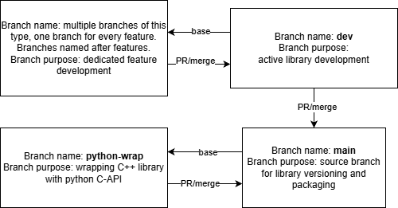

# MODA
A comprehensive suite of hypervolume-related algorithms designed for efficient multi-objective optimization

## Installation guide
The library is going to be availiable via packet managers PyPi (python wrap) and VCPKG (C++ original library). Additionally, the library makes use of the CMake for Windows and the Make for Linux based operating systems. 

Currently the library is under pull request review for VCPKG, hence we provide an ad-hoc installation guideline. Note that this is work in progress, and this process should be used with necessary care.

1. Clone (or download and unzip) the [VCPKG](https://github.com/microsoft/vcpkg) repository.
2. Run `bootstrap-vcpkg.bat`
   (optionally) Set up environmental variables for the VCPKG
3. Create a new directory in `vcpkg/ports` and name it `moda`
4. From this repository, the `vcpkg-moda` directory, download the `portfile.cmake` and `vcpkg.json`. Paste those files into the newly created `vcpkg/ports/moda` directory.
5. Direct to main vcpkg directory and install moda library with the `.\vcpkg.exe install moda` command (by default it installs for x64 architecture, if you wish to use any other architecture, use additional triplet, such as `.\vcpkg.exe install moda:x86-windows-static`)
6. Run the `.\vcpkg.exe integrate install`

### Installing the python package

Make sure that you have numpy installed (tested for >=1.18.0, preferred >=2.2.6).

0. Set up the Python 3 kernel (at this stage it is preferred to use the library in a controlled virtual environment - `python -m venv .venv` + `source .venv/bin/activate`) 
1. Clone the repository
2. Navigate to moda/python-wrap
3. Install the library with `pip install .`

## Consuming the library

 #####  A. CMake Projects
If your project uses CMake, integration is automatic and preferred. Simply include the Vcpkg toolchain file in your configuration step and use find_package in your CMakeLists.txt

##### B. Visual Studio (MSBuild) Projects
For Visual Studio projects, while Vcpkg handles include paths, you may need to manually specify the library file to resolve LNK2001/LNK2019 errors.

1. Locate the Library: Find the compiled library in your Vcpkg installation path, typically: vcpkg\packages\moda_<triplet>\lib\moda.lib for Release type projects or vcpkg\packages\moda_<triplet>\debug\lib\modad.lib for Debug type projects.

2. Add to Linker: In Visual Studio, go to Project Properties -> Linker -> Input. Append the full path to moda.lib to the Additional Dependencies property.

### Minimal program

After the installation, you should be able to include the library files in any project. 

The MODA library follows a Data-Solver-Result pattern. DataSets hold the objective function values, Solvers encapsulate the algorithms (like Hypervolume calculation), and Results return the metrics.

This example demonstrates loading a sample dataset, configuring the IQHVSolver (Improved Quick Hypervolume), and calculating the resulting hypervolume.
```cpp

       // 1. Load Data
    // Loads sample data from file (file must be accessible in execution directory)
    DataSet* ds = moda::DataSet::LoadFromFilename("../../sample-file/data_6_500_convex_triangular_1");

    // Display data points one by one
    std::cout << "Loaded Data Points:\n";
    for (auto p : ds->points)
    {
        for (int i = 0; i < ds->getParameters()->NumberOfObjectives; i++)
            std::cout << p->ObjectiveValues[i] << " ";
        std::cout << "\n";
    }
    std::cout << "---------------------------------\n";

    // 2. Prepare Data and Solver
    ds->typeOfOptimization = moda::DataSet::minimization; // Set optimization type
    ds->normalize();                                      // Apply normalization

    moda::IQHVSolver solver;
    moda::IQHVParameters params;

    // 3. Set Solver Parameters
    // Sets calculation formulas for the reference points (zeroone substitues zeroes and ones vectors for reference points)
    using RefStyle = moda::IQHVParameters::ReferencePointCalculationStyle;
    params.BetterReferencePointCalculationStyle = RefStyle::zeroone;
    params.WorseReferencePointCalculationStyle = RefStyle::zeroone;

    // 4. Run Solve and Display Result
    // Solve returns a pointer to a HypervolumeResult
    moda::HypervolumeResult* result = solver.Solve(ds, params);

    std::cout << "Calculated Hypervolume: " << result->HyperVolume << std::endl;
    std::cout << "Elapsed Time (ms): " << result->ElapsedTime << std::endl;

    // Cleanup (optional but recommended)
    delete ds;
    delete result;
```

## Branching Strategy & Development Lifecycle

This project follows a structured branching model designed to support active development, feature expansion, and Python API integration while keeping the main branch stable for releases and packaging.
|  | 
|:----------------------------------------:|
 ### Main Branch (main)

*Purpose:*
The main branch serves as the source of truth for stable library releases.

It contains code intended for:

    - Versioning
    - Packaging
    - Distribution (e.g., vcpkg, PyPI, internal deployment)

*Characteristics*:
    - Always stable
    - Updated through pull requests from dev or python-wrap
    - Tagged for official releases

### Development Branch (dev)

*Purpose*:
The dev branch is the central hub for active development of the C++ library.

*Characteristics*:

    - Contains ongoing improvements
    - Integrates completed feature branches
    - Eventually merged into main once stable
    - All standard development flows into dev before being prepared for release.

### Feature Branches (feature/*)

*Purpose:*
Feature branches are used for isolated, focused development of new features or fixes.

*Characteristics:*

Named based on their feature

e.g., 1-matrix-ops, 2-simd-optimizations

Branched from dev

Merged back into dev after completion via pull request

### Python Wrapper Branch (python-wrap)

*Purpose*:
The python-wrap branch is dedicated solely to the Python C-API wrapper of the C++ library.

*Characteristics*:

Used for independent development of Python bindings

Branched from main

Merged back into main when new wrapper features are complete


