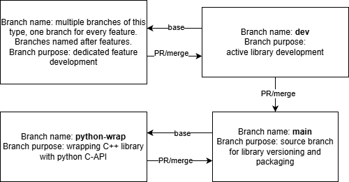

# MODA
A comprehensive suite of hypervolume-related algorithms designed for efficient multi-objective optimization

### Documentation

The library documentation is available at ReadTheDocs: https://moda-put.readthedocs.io/en/latest
The installation process is described in the documentation.

### Minimal program

After the installation, you should be able to include the library files in any project. 

The MODA library follows a Data-Solver-Result pattern. DataSets hold the objective function values, Solvers encapsulate the algorithms (like Hypervolume calculation), and Results return the metrics.

This example demonstrates loading a sample dataset, configuring the IQHVSolver (Improved Quick Hypervolume), and calculating the resulting hypervolume.
```cpp

       // 1. Load Data
    // Loads sample data from file (file must be accessible in execution directory)
    DataSet* ds = moda::DataSet::LoadFromFilename("../../sample-file/data_6_500_convex_triangular_1");

    // Display data points one by one
    std::cout << "Loaded Data Points:\n";
    for (auto p : ds->points)
    {
        for (int i = 0; i < ds->getParameters()->NumberOfObjectives; i++)
            std::cout << p->ObjectiveValues[i] << " ";
        std::cout << "\n";
    }
    std::cout << "---------------------------------\n";

    // 2. Prepare Data and Solver
    ds->typeOfOptimization = moda::DataSet::minimization; // Set optimization type
    ds->normalize();                                      // Apply normalization

    moda::IQHVSolver solver;
    moda::IQHVParameters params;

    // 3. Set Solver Parameters
    // Sets calculation formulas for the reference points (zeroone substitues zeroes and ones vectors for reference points)
    using RefStyle = moda::IQHVParameters::ReferencePointCalculationStyle;
    params.BetterReferencePointCalculationStyle = RefStyle::zeroone;
    params.WorseReferencePointCalculationStyle = RefStyle::zeroone;

    // 4. Run Solve and Display Result
    // Solve returns a pointer to a HypervolumeResult
    moda::HypervolumeResult* result = solver.Solve(ds, params);

    std::cout << "Calculated Hypervolume: " << result->HyperVolume << std::endl;
    std::cout << "Elapsed Time (ms): " << result->ElapsedTime << std::endl;

    // Cleanup (optional but recommended)
    delete ds;
    delete result;
```

## Branching Strategy & Development Lifecycle

This project follows a structured branching model designed to support active development, feature expansion, and Python API integration while keeping the main branch stable for releases and packaging.
|  | 
|:----------------------------------------:|
 ### Main Branch (main)

*Purpose:*
The main branch serves as the source of truth for stable library releases.

It contains code intended for:

    - Versioning
    - Packaging
    - Distribution (e.g., vcpkg, PyPI, internal deployment)

*Characteristics*:
    - Always stable
    - Updated through pull requests from dev or python-wrap
    - Tagged for official releases

### Development Branch (dev)

*Purpose*:
The dev branch is the central hub for active development of the C++ library.

*Characteristics*:

    - Contains ongoing improvements
    - Integrates completed feature branches
    - Eventually merged into main once stable
    - All standard development flows into dev before being prepared for release.

### Feature Branches (feature/*)

*Purpose:*
Feature branches are used for isolated, focused development of new features or fixes.

*Characteristics:*

Named based on their feature

e.g., 1-matrix-ops, 2-simd-optimizations

Branched from dev

Merged back into dev after completion via pull request

### Python Wrapper Branch (python-wrap)

*Purpose*:
The python-wrap branch is dedicated solely to the Python C-API wrapper of the C++ library.

*Characteristics*:

Used for independent development of Python bindings

Branched from main

Merged back into main when new wrapper features are complete


