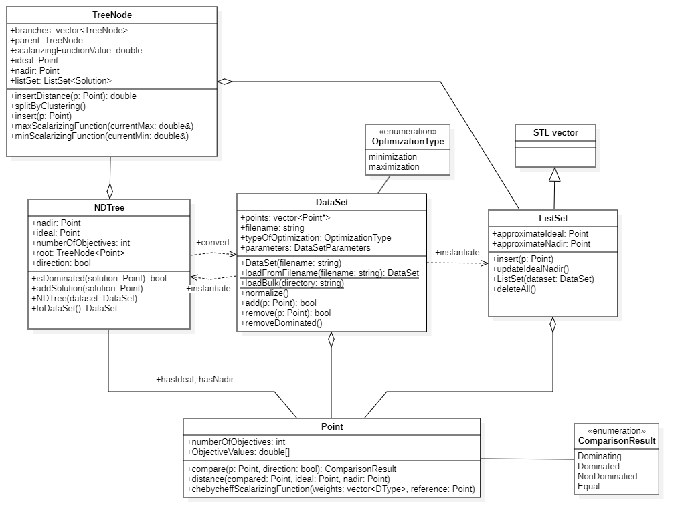

DataSet management
=====

   Solvers Hierarchy.

.. _tutorials_datasets:

.. cpp:namespace:: moda

DataSet Class
=============

.. cpp:class:: DataSet : public SolutionContainer

   This class represents an optimization problem (a dataset), which is comprised of a set of points.

   .. cpp:enum:: OptimizationType

      .. cpp:enumerator:: minimization
      .. cpp:enumerator:: maximization

      Defines the optimization goal. Defaults to :cpp:enumerator:`maximization`.

   .. rubric:: Public Members

   .. cpp:member:: std::vector<Point*> points

      A set of points in the dataset. 

   .. cpp:member:: std::string filename

      Full path to the source file.

   .. cpp:member:: OptimizationType typeOfOptimization

      Type of this problem.

   .. rubric:: Constructors

   .. cpp:function:: DataSet(int nObjectives = 2)

      Non-parametrized constructor.

   .. cpp:function:: DataSet(const DataSet& dataset)

      Copy constructor.

   .. cpp:function:: DataSet(const std::string filename, bool normalizedName)

      Reads data from a file. If `normalizedName` is true, meta properties are inferred from the filename 
      (e.g., ``name_of_experiment_dXXX_nXXX_ZZ``).

   .. cpp:function:: DataSet(const std::string filename, DataSetParameters settings)

      Reads data from a file using provided dataset properties.

   .. cpp:function:: DataSet(const std::string filename, std::string name, int dimensions, int sample, int nPoints)

      Reads data from a file with explicitly provided experiment metadata.

   .. rubric:: Accessors & Modifiers

   .. cpp:function:: Point* getIdeal()

      Gets the value of ideal point.

   .. cpp:function:: Point* getNadir()

      Gets the value of nadir point.

   .. cpp:function:: void setIdeal(Point*)

      Aribtrarily sets the ideal point.

   .. cpp:function:: void setNadir(Point*)

      Aribtrarily sets the nadir point.

   .. cpp:function:: void setParameters(DataSetParameters settings)
   .. cpp:function:: void setDimensionality(int dim)
   .. cpp:function:: void setName(std::string name)
   .. cpp:function:: void setNumberOfPoints(int npts)
   .. cpp:function:: void setSampleNumber(int sampleN)

      Setters for dataset metadata.

   .. rubric:: Stream & File Operations

   .. cpp:function:: std::istream& Load(std::istream& stream)

      Reads the dataset from an input stream.

   .. cpp:function:: void Save(const std::string filename)

      Saves the dataset to a file.

   .. cpp:function:: static DataSet* LoadFromFilename(const std::string filename)

      Factory method to load a dataset from a file.

   .. cpp:function:: static std::vector<DataSet*> LoadBulk(const std::string directory)

      Loads multiple datasets from a directory.

   .. cpp:function:: NDTree<Point> toNDTree()

      Converts the dataset to an NDTree.

   .. rubric:: Functions & Normalization

   .. cpp:function:: void normalize()

      Normalizes the dataset.

   .. cpp:function:: void reverseObjectives()

      Reverses the objectives for the points.

   .. cpp:function:: bool add(Point* point)

      Adds a single point to the dataset.

   .. cpp:function:: bool remove(Point* point)

      Removes a given point from the dataset (value driven).

   .. cpp:function:: void clear()

      Clears the dataset.

   .. cpp:function:: void RemoveDominated()

       
      Removes all dominated points from the dataset.
      
   .. cpp:function:: DataSetParameters getParameters()
      
      This function returns hyperparameters of the dataset (such as filename, number of objectives) encapsulated as :cpp:class:`DataSetParameters` object.

   .. rubric:: Grouping

   .. cpp:function:: static std::vector<std::vector<DataSet>> BulkGroup(std::vector<DataSet> problems, ProblemGrouping grouping)

      Groups a set of datasets according to a given criteria. (enum ProblemGrouping { Name, Dimensionality, NameDimensionality };)

DatasetParameters
~~~~~~~~~~~~~~~~~~

.. cpp:class:: DataSetParameters

   Configuration parameters for defining and identifying datasets within the experiments.

   .. cpp:member:: OptimizationType optType

      .. deprecated:: 1.0
         This member is currently unused.

   .. cpp:member:: std::string filename

      The path or filename associated with the dataset.

   .. cpp:member:: std::string name

      The descriptive name of the experiment.

   .. cpp:member:: int NumberOfObjectives

      The dimensionality (number of objectives) of the dataset.

   .. cpp:member:: int nPoints

      The total number of points contained in the dataset.

   .. cpp:member:: int sampleNumber

      The specific sample index for the experiment.

   .. cpp:function:: DataSetParameters()

      Non-parameterized constructor.

   .. cpp:function:: DataSetParameters(std::string name, int dimensions, int nPoints, int sampleNumber)

      Parameterized constructor to initialize dataset properties.

   .. cpp:function:: DataSetParameters(std::string filename)

      Constructs the object by parsing metadata directly from the provided filename.

   .. cpp:function:: ~DataSetParameters()

      Destructor for the class.

   .. cpp:enum:: OptimizationType

      Defines the optimization goal.

      .. cpp:enumerator:: max

         Maximization problem.

      .. cpp:enumerator:: min

         Minimization problem.
NDTree class
------------
.. cpp:class:: template<class Solution> NDTree

   A tree-based data structure used for maintaining a non-dominated set of solutions.

   .. cpp:member:: std::vector<Solution*> listSet

      Internal storage for solutions contained within the archive.

   .. cpp:member:: Point NadirPoint

      The nadir point of the current non-dominated set.

   .. cpp:member:: Point IdealPoint

      The ideal point of the current non-dominated set.

   .. cpp:member:: int NumberOfObjectives

      The dimensionality of the objective space.

   .. cpp:member:: bool maximization

      Determines if the tree is configured for maximization (true) or minimization (false).

   .. cpp:member:: TreeNode<Solution>* root

      Pointer to the root node of the :cpp:class:`TreeNode` structure.

   .. cpp:function:: void saveToList()

      Synchronizes the tree structure to the :cpp:member:`listSet`.

   .. cpp:function:: std::string listToString()

      Serializes the contents of the non-dominated set to a string.

   .. cpp:function:: long numberOfSolutions()

      Returns the total count of non-dominated solutions stored.

   .. cpp:function:: virtual bool isDominated(Point& ComparedSolution)

      Checks if the provided solution is dominated by any point currently in the archive.

   .. cpp:function:: virtual bool update(Point& NewSolution, bool checkDominance)

      Attempts to insert a new solution into the archive, optionally performing a dominance check.

   .. cpp:function:: virtual bool update(Point& NewSolution)

      Standard update method to insert or reject a solution based on current archive state.

   .. cpp:function:: void Save(char* FileName)

      Persists the non-dominated set to a file.

   .. cpp:function:: void DeleteAll()

      Clears all stored solutions and resets the tree.

   .. cpp:function:: DataSet* toDataSet()

      Converts the archive into a :cpp:class:`DataSet` object.

   .. cpp:function:: NDTree(bool maximization = true)

      Constructs an empty NDTree.

   .. cpp:function:: NDTree(DataSet dataset, bool maximization = true)

      Constructs an NDTree initialized with an existing :cpp:class:`DataSet`.

   .. cpp:function:: ~NDTree()

      Destructor for resource cleanup.

Point class
===========

.. cpp:class:: Point

   Represents a point in the objective space for multi-objective optimization problems.

   .. cpp:member:: int NumberOfObjectives

      The number of objectives defining the space.

   .. cpp:member:: DType ObjectiveValues[MAXOBJECTIVES]

      The array containing objective values for the point.

   .. cpp:member:: Point()

      Default constructor.

   .. cpp:member:: Point(int NumberOfObjectives)

      Parameterized constructor.

   .. static_method:: Point ones(int NumberOfObjectives)

      Creates a point with all objective values set to 1.

   .. static_method:: Point elevens(int NumberOfObjectives)

      Creates a point with all objective values set to 11.

   .. static_method:: Point negElevens(int NumberOfObjectives)

      Creates a point with all objective values set to -11.

   .. static_method:: Point zeroes(int NumberOfObjectives)

      Creates a point with all objective values set to 0.

   .. cpp:function:: Point(const Point& Point)

      Copy constructor.

   .. cpp:function:: ComparisonResult Compare(Point& point, bool maximization)

      Compares this point with another based on the provided maximization flag.

   .. cpp:function:: DType operator const

      Getter operator for objective values.

   .. cpp:function:: DType get(int n) const

      Getter for objective values.

   .. cpp:function:: DType& operator

      Setter operator for objective values.

   .. cpp:function:: std::istream& Load(std::istream& Stream)

      Reads the point data from an input stream.

   .. cpp:function:: std::ostream& Save(std::ostream& Stream)

      Saves objective values to an open output stream, separated by tabs.

   .. cpp:function:: DType Distance(Point& ComparedPoint, Point& IdealPoint, Point& NadirPoint)

      Calculates the distance between points, normalized by Ideal and Nadir points.

   .. cpp:function:: DType CleanChebycheffScalarizingFunctionInverse(std::vector<DType>& weightVector, Point& referencePoint)

      Calculates the inverse Clean Chebycheff scalarizing function.

   .. cpp:function:: DType CleanChebycheffScalarizingFunctionOriginal(std::vector<DType>& weightVector, Point& referencePoint)

      Calculates the original Clean Chebycheff scalarizing function.

Code Snippets
=============

Creating Dataset Ad-hoc
~~~~~~~~~~~~~~~~~~~~~~~~

.. code-block:: cpp 

   #include <moda\DataSet.h>
   #include <iostream>
   int main()
   {
      moda::DataSet* dataSet = new moda::DataSet(2);
      for (int i = 0; i < 10; i++)
      {
         moda::Point* newPoint = new moda::Point(2);
         newPoint->ObjectiveValues[0] = i * 0.1;
         newPoint->ObjectiveValues[1] = i * 0.1;
         dataSet->add(newPoint);
      }
   }

Loading dataset from file
~~~~~~~~~~~~~~~~~~~~~~~~~~
.. code-block:: cpp
   
   #include <moda\DataSet.h>
   #include <iostream>
   int main()
   {
      moda::DataSet* dataSet = moda::DataSet::LoadFromFilename("C://Users//kubad//moda//moda//sample-file//linear_d4n100_1");
      std::cout << "DataSet loaded. Number of points: " << dataSet->getParameters()->nPoints;
      std::cout << ", Number of objectives: " << dataSet->getParameters()->NumberOfObjectives << std::endl;
   }

Loading multiple datasets from a single directory
~~~~~~~~~~~~~~~~~~~~~~~~~~~~~~~~~~~~~~~~~~~~~~~~~~
.. code-block:: cpp

   #include <moda\DataSet.h>
   #include <iostream>
   int main()
   {
      std::vector<moda::DataSet*> datasets = moda::DataSet::LoadBulk("C://Users//kubad//Downloads//HVE//HVE//source-code//data//data");
      for (moda::DataSet* dataset : datasets)
      {
         std::cout << "Dataset: " << dataset->getParameters()->filename << std::endl;
      }
   }

Filtering out dominated points using ND-Tree
~~~~~~~~~~~~~~~~~~~~~~~~~~~~~~~~~~~~~~~~~~~~~~~~~~~~
 .. code-block:: cpp

   #include <moda\DataSet.h>
   #include <iostream>
   int main()
   {
      moda::DataSet* dataSet = moda::DataSet::LoadFromFilename("dominated_points");
      std::cout << "Loaded dataset with: " << dataSet->points.size() << " points." << std::endl;
      moda::NDTree ndtree = dataSet->toNDTree();
      moda::DataSet* nonDominatedDataSet = ndtree.toDataSet();
      std::cout << "Dataset size after ND-Tree based filtering: " << nonDominatedDataSet->points.size() << " points." << std::endl;
      moda::IQHVParameters* parameters = new moda::IQHVParameters(moda::SolverParameters::ReferencePointCalculationStyle::zeroone, moda::SolverParameters::ReferencePointCalculationStyle::zeroone);
      moda::IQHVSolver solver;
      auto result = solver.Solve(dataSet, *parameters);
      auto resultPruned = solver.Solve(nonDominatedDataSet, *parameters);
      std::cout << "Hypervolume of a set with dominated points: " << result->HyperVolume << " time: " << result->ElapsedTime << "ms" << std::endl;
      std::cout << "Hypervolume of a set without dominated points: " << resultPruned->HyperVolume << " time: " << resultPruned->ElapsedTime << "ms";
      return 0;
   }
   // Result:
   //   Loaded dataset with: 15 points.
   //   Dataset size after ND-Tree pruning: 10 points.
   //   Solution 1: 0.3825 time: 1ms
   //   Solution 2: 0.3825 time: 0ms