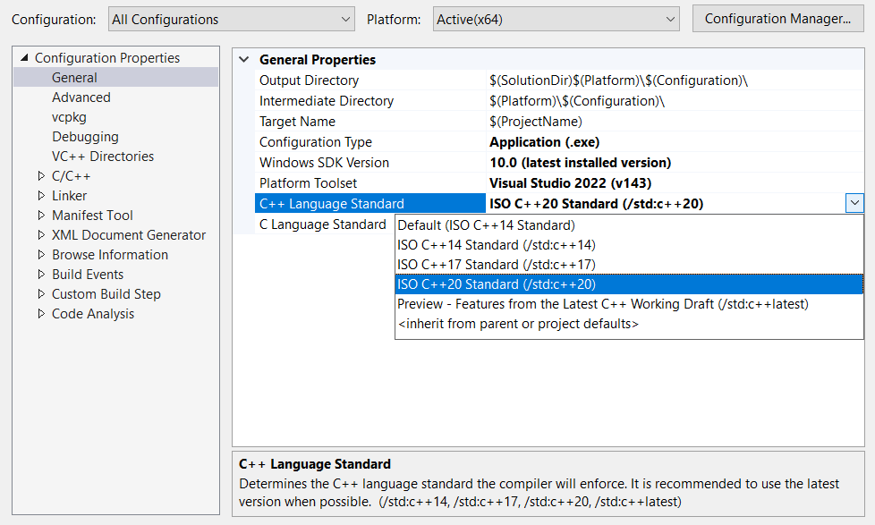
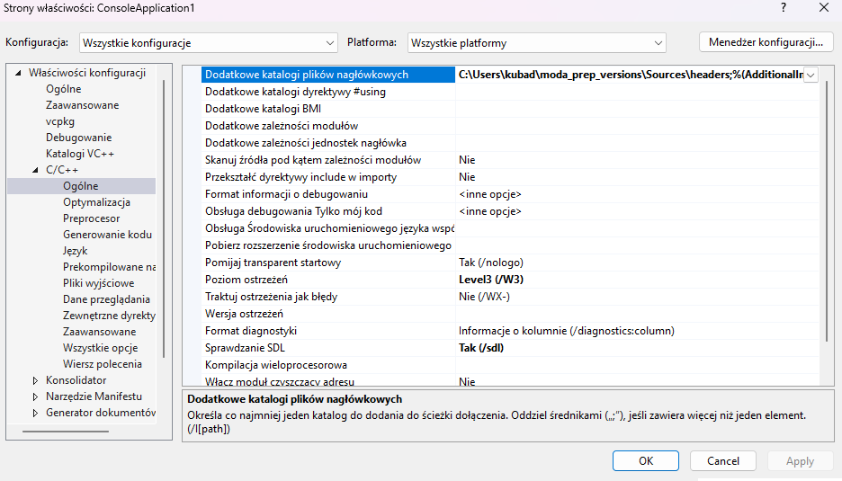
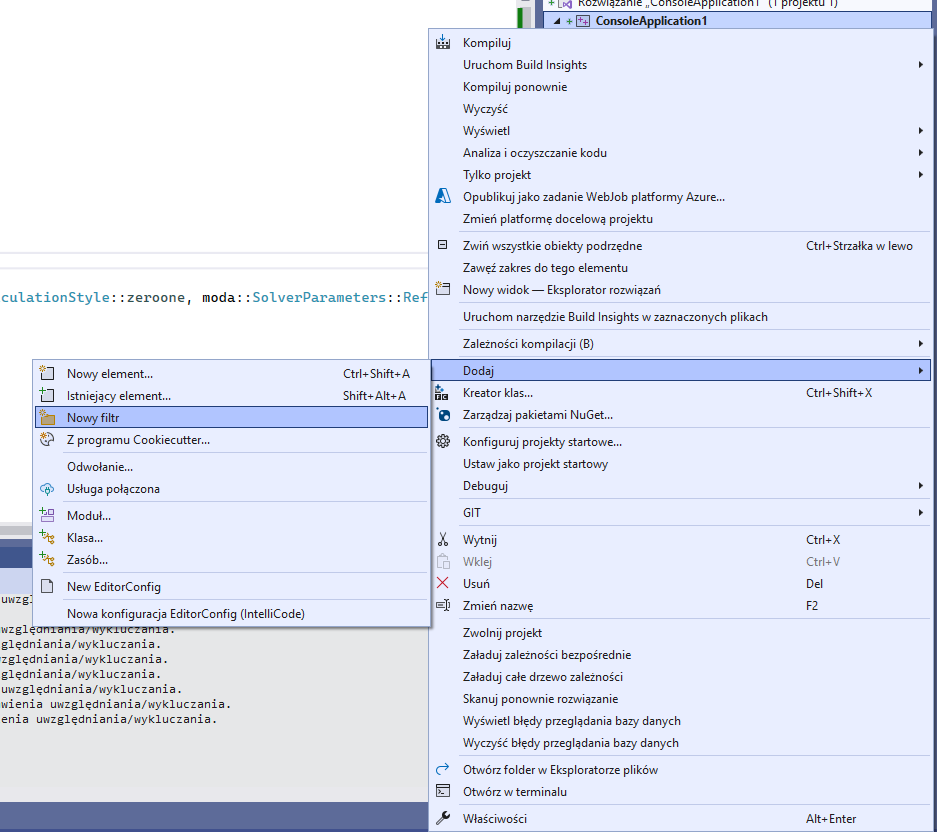
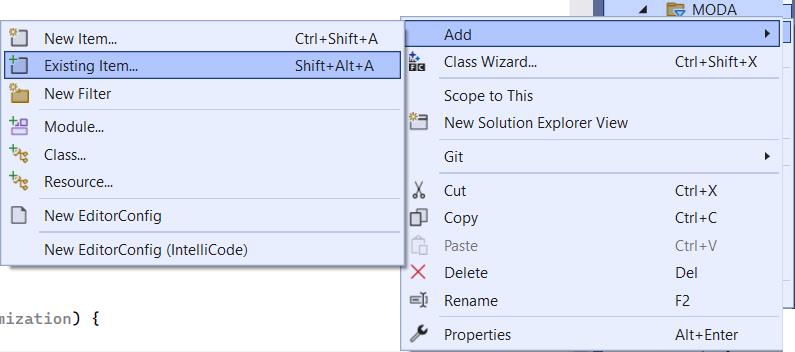

Installation on Windows
=====

.. _installation_win:

Visual Studio
------------

If you are working with Visual Studio IDE, this is the first tutorial you should go through. It explains how to install and configure your MODA library instance within the Visual Studio environment.

Downloading MODA library
~~~~~~~~~~~~

First you must download the MODA SDK from the :ref:`downloads` page. For this tutorial you should use the `Sources` version. Extract the files anywhere you like. Copying the files into your Visual Studio installation folder is not recommended. Choose a dedicated location, especially if you intend to use several versions of the same library or you intend to use various compilers.

Creating the MODA Visual Studio project. 
~~~~~~~~~~~~~

Use the Visual Studio IDE to create a C++ based project. Any type of the project is allowed, however it is recommended to use the *Empty Application*.
For the purpose of this tutorial, you should create a main.cpp file and add it to the project, so that we have access to the C++ settings (otherwise Visual Studio doesn't know which language you're going to use for this project).

First we need to configure the IDE to use the proper standard. MODA library is tested and compatible with C++17 and later versions. We recommend using the latest C++ version available.
In the project properties under "C/C++" Language tab, change the "C++ Language Standard" dropdown to the desired version (C++17 or higher). 

   Pick the proper C++ version. 

Now we need to tell the compiler where to find the MODA headers (.h files), and add source files (.cpp) to the project.

In the project's properties, add:

The path to the MODA headers (<moda-install-path>/moda) to C/C++ > General > Additional Include Directories

   Headers directory. 

Now, create a new Filter in your project and name it `MODA`.

   Create a new filter in the project. 

Add all library source files to that filter. 

   Add all files to the filter (note: you can select multiple files in a single dialog). 

Your project is ready, let's write some code now to make sure that it works. Put the following code inside the main.cpp file:

.. code-block:: cpp

   #include <DataSet.h>
   #include <IQHVSolver.h>
   #include <SolverParameters.h>
   #include <Point.h>
   #include <iostream>
   int main()
   {
      moda::DataSet* dataSet = new moda::DataSet(2);
      for (int i = 0; i < 10; i++)
      {
         moda::Point* newPoint = new moda::Point(2);
         newPoint->ObjectiveValues[0] = i * 0.1;
         newPoint->ObjectiveValues[1] = i * 0.1;
         dataSet->add(newPoint);
      }
      moda::IQHVSolver solver;
      moda::IQHVParameters* parameters = new moda::IQHVParameters(moda::SolverParameters::ReferencePointCalculationStyle::zeroone, moda::SolverParameters::ReferencePointCalculationStyle::zeroone);
      auto result = solver.Solve(dataSet, *parameters);
      std::cout << "Hypervolume: " << result->HyperVolume << std::endl;
      delete dataSet;
      return 0;
   }

If you recieve the following output: ``Hypervolume: 0.81``, the library has been installed properly.

CMake
----------------

Work in progress

VCPKG
----------------

Work in progress

