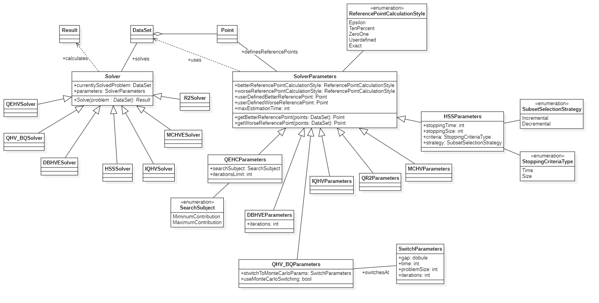

Problem solvers
=====

.. _tutorials_solvers:

.. _moda-solver:

Once we have our data prepared for analysis and processing, we can employ a set of Solvers for the task. The MODA library implements variety of hypervolume centered methods. This section lists all the solvers and provides simple code snippets for each of the algorithms.

Solvers
============

Let's start by listing all the base types. The library uses a hierarchical structure, each task is executed with a dedficated solver. The solver accepts a set of hyperparameters and returns a result embedded in an object of a dedicated type. Before we move onto the detailed solvers, let's describe the base classes.

Base Solver Class
-----------------

.. cpp:namespace:: moda

.. cpp:class:: Solver

   The base class providing an interface and utility methods for solving optimization problems.

   .. cpp:member:: DataSet* currentlySolvedProblem

      Pointer to the dataset currently being processed.

   .. cpp:member:: DataSetParameters* currentSettings

      Pointer to the configuration settings for the current problem.

   .. cpp:member:: void (*StartCallback)(DataSetParameters problemSettings, std::string SolverMessage)

      Called when the solver starts execution.

   .. cpp:member:: void (*IterationCallback)(int currentIteration, int totalIterations, Result* stepResult)

      Called at the end of each iteration to report progress.

   .. cpp:member:: void (*EndCallback)(DataSetParameters problemSettings, Result* stepResult)

      Called upon the completion of the solving process.

   Public Methods
   --------------

   .. cpp:function:: virtual Result* Solve(DataSet* problem, SolverParameters settings)

      Abstract Solve function. Each solver implements it to solve the problem and return a result.

   Protected Methods
   -----------------

   .. cpp:function:: void prepareData(DataSet* problem, SolverParameters settings)

      Prepares operational data structures before starting the solver.

The `moda` library utilizes a configuration system for various optimization solvers. All specific solver settings inherit from the base :cpp:class:`SolverParameters` class.

Base Solver Parameters Class
----------------------------

.. cpp:class:: SolverParameters

   The foundational class for all solver configurations.

   .. cpp:enum:: ReferencePointCalculationStyle

    Enumeration of all methods for calculating the reference points.

      .. cpp:enumerator:: epsilon 
         
         For the dataset :math:`X \subseteq \mathbb{R}^n`, define the minimum and maximum values for each dimension :math:`i` as:

         .. math::
               m_i = \min_{x \in X} (x_i), \quad M_i = \max_{x \in X} (x_i) .

         The adjusted reference points are defined as:

         .. math::
               \{ m_i - \epsilon \mid 0 < i \le n \}, 

               \{ M_i + \epsilon \mid 0 < i \le n \} .

         .. note::
         The parameter :math:`\epsilon` is currently set to a default value of **0.001**. 
         You can modify this value by updating the corresponding constant in the ``include.h`` file.

      .. cpp:enumerator:: tenpercent

         For the dataset :math:`X \subseteq \mathbb{R}^n`, define the minimum and maximum values for each dimension :math:`i` as:

         .. math::

               m_i = \min_{x \in X} (x_i), \quad M_i = \max_{x \in X} (x_i) .

         The adjusted reference points are defined as:

         .. math::

               \{ m_i - 0.1 \cdot |m_i - M_i| \mid 0 < i \le n \}, 

               \{ M_i + 0.1 \cdot |m_i - M_i| \mid 0 < i \le n \} .

      .. cpp:enumerator:: zeroone

         For the dataset :math:`X \subseteq \mathbb{R}^n`, the reference points are defined as:

         .. math::

               \{ 0 \mid 0 < i \le n \}, 

               \{ 1 \mid 0 < i \le n \} .

      .. cpp:enumerator:: userdefined

         The reference points are defined by user prior to the solver execution. In order to use this setting declare the worseReferencePoint and betterReferencePoint values.

      .. cpp:enumerator:: exact

         For the dataset :math:`X \subseteq \mathbb{R}^n`, the reference points are defined as:

         .. math::

               \{ \min_{x \in X} (x_i) \mid 0 < i \le n \}, 

               \{ \max_{x \in X} (x_i) \mid 0 < i \le n \} .

      .. cpp:enumerator:: pymoo

         For the dataset :math:`X \subseteq \mathbb{R}^n`, define the minimum and maximum values for each dimension :math:`i` as:

         .. math::

            m_i = \min_{x \in X} (x_i), \quad M_i = \max_{x \in X} (x_i) .

         The adjusted reference points are defined as:

         .. math::

            \{ m_i - 10 \mid 0 < i \le n \}, 

            \{ M_i + 10 \mid 0 < i \le n \} .

   .. cpp:member:: ReferencePointCalculationStyle BetterReferencePointCalculationStyle

      How to calculate the better reference point (see the enum above).

   .. cpp:member:: ReferencePointCalculationStyle WorseReferencePointCalculationStyle

      How to calculate the worse reference point (see the enum above).

   .. cpp:member:: bool callbacks

      Toggle to enable or disable iteration callbacks.

   .. cpp:member:: int MaxEstimationTime

      Maximum time allowed for the estimation process (in ms).

   .. cpp:member:: Point* worseReferencePoint;

        User defined reference point;for minimization: lower boundary point of the problem; for maximization: upper boundary point of the problem 

   .. cpp:member:: Point* betterReferencePoint;

        User defined reference point; for minimization: upper boundary point of the problem; for maximization: lower boundary point of the problem
        
   .. cpp:function:: Point* GetWorseReferencePoint(DataSet *set)

        This function returns the worse reference point according to the chosen method.

   .. cpp:function:: Point* GetBetterReferencePoint(DataSet *set)

        This function returns the better reference point according to the chosen method.

Base Result Class
-----------------

The base result class is very simple it only denotes the elapsed time and information wether this is the final or intermediate result.
Additionally it carries meta information on the method name and auxiliary, additional denotion of the result type.

.. cpp:class:: Result

   Represents the output and metadata for a calculation process.

   .. cpp:member:: int ElapsedTime

      Time passed since the beginning of the calculation given in ms.

   .. cpp:member:: bool FinalResult

      Is this the final result of the calculation.

   .. cpp:enum:: ResultType

      Enumeration of all result types.

      .. cpp:enumerator:: Hypervolume
      .. cpp:enumerator:: Estimation
      .. cpp:enumerator:: Contribution
      .. cpp:enumerator:: SubsetSelection
      .. cpp:enumerator:: R2

   .. cpp:member:: ResultType type

      Additional annotation of the result type (auxiliary).

   .. cpp:member:: std::string methodName

      The name of the method used for the calculation.

Dedicated Solvers
==================

MODA library uses a hierarchical structure of solvers designated for various tasks. This set of derived classes servers as a programming interface to the library computation kernel. 

   Solvers Hierarchy.

Improved Quick Hypervolume
--------------------------

Classes
~~~~~~~
.. cpp:class:: IQHVSolver : public Solver

   This class implements exact hypervolume calculation as described in [Andrzej Jaszkiewicz. 2018. Improved quick hypervolume algorithm. Comput. Oper. Res. 90, C (February 2018), 72–83. https://doi.org/10.1016/j.cor.2017.09.016]

.. cpp:class:: IQHVParameters : public SolverParameters
   
   Settings for IQHV - a method of finding exact hypervolume. This class includes no additional parameters.

.. cpp:class:: HypervolumeResult : public Result

   Calculated hypervolume result inheriting from the base :cpp:class:`Result` class.

   .. cpp:member:: float HyperVolume

      The resulting hypervolume value calculated by the process.

Code snippet
~~~~~~~~~~~~
.. code-block:: cpp

   #include <moda\DataSet.h>
   #include <moda\IQHVSolver.h>
   #include <moda\SolverParameters.h>
   #include <moda\Point.h>
   #include <iostream>
   int main()
   {
      moda::DataSet* dataSet;
      //Load the dataset according to the Datasets section.
      moda::IQHVSolver solver;
      moda::IQHVParameters* parameters = new moda::IQHVParameters(moda::SolverParameters::ReferencePointCalculationStyle::zeroone, moda::SolverParameters::ReferencePointCalculationStyle::zeroone);
      moda::HypervolumeResult* result = solver.Solve(dataSet, *parameters);
      std::cout << "Hypervolume: " << result->HyperVolume << std::endl;
      return 0;
   }

Distance based hypevolume estimation
==========================

Classes
-------
.. cpp:class:: DBHVESolver : public Solver

This class implements the hypervolume estimation as described in [Jaszkiewicz, Andrzej & Zielniewicz, Piotr. (2024). Improving the Efficiency of the Distance-Based Hypervolume Estimation Using ND-Tree. IEEE Transactions on Evolutionary Computation. PP. 1-1. 10.1109/TEVC.2024.3391857.]

.. cpp:class:: DBHVEParameters : public SolverParameters
   
   Settings for DBHVE - a method of finding hypervolume estimation expressed as a real number.

   .. cpp:member:: unsigned MCIterations

      Number of iterations. 
   

.. cpp:class:: BoundedResult : public Result

   Result class providing bounded estimation values, inheriting from :cpp:class:`Result`. This class will be used for all "bounded" result types. 

   .. cpp:member:: bool Guaranteed

      Flag indicating if the lower and upper bounds are exact. If true, the precise value is guaranteed to be within these bounds. This is typically false for Monte Carlo methods.

   .. cpp:member:: float LowerBound

      Lower bound of the hypervolume.

   .. cpp:member:: float UpperBound

      Upper bound of the hypervolume.

   .. cpp:member:: float HyperVolumeEstimation

      The estimated hypervolume value.

   Code Snippet
   ~~~~~~~~~~~~

   .. code-block:: cpp

      #include <moda\DataSet.h>
      #include <moda\QEHCSolver.h>
      #include <moda\SolverParameters.h>
      #include <moda\Point.h>
      #include <moda\Result.h>
      #include <iostream>
      int main()
      {
         moda::DataSet* dataSet;
         //Load the dataset according to the Datasets section.
         moda::QEHCSolver solver;
         moda::QEHCParameters* parameters = new moda::QEHCParameters(moda::SolverParameters::ReferencePointCalculationStyle::zeroone, moda::SolverParameters::ReferencePointCalculationStyle::zeroone);
         parameters->SearchSubject = moda::QEHCParameters::SearchSubjectOption::MaximumContribution;
         moda::QEHCResult* result = solver.Solve(dataSet, *parameters);
         std::cout << "Maximum contribution: " << result->MaximumContribution << std::endl;
         std::cout << "Maximum contributor index: " << result->MaximumContributionIndex << std::endl;
         return 0;
      }

Quick Extreme Hypervolume Contributor detection
------------------------------------------------

Classes
~~~~~~~

.. cpp:class:: QEHCSolver : public Solver

This class implements an algorithm for finding the extreme hypervolume contributor. It is described in [Andrzej Jaszkiewicz and Piotr Zielniewicz. 2021. Quick extreme hypervolume contribution algorithm. In Proceedings of the Genetic and Evolutionary Computation Conference (GECCO '21). Association for Computing Machinery, New York, NY, USA, 412–420. https://doi.org/10.1145/3449639.3459394]

.. cpp:class:: QEHCParameters : public SolverParameters

   Parameters for the QEHC Solver.

   .. cpp:enum:: SearchSubjectOption

      .. cpp:enumerator:: MinimumContribution

        The QEHC process will search for minimum contributor. 

      .. cpp:enumerator:: MaximumContribution

        The QEHC process will search for maximum contributor. 

      .. cpp:enumerator:: Both

        The QEHC process will search for both maximum and minimum contributor at once (not implemented). 

.. cpp:class:: QEHCResult : public Result

   Result class specific to Quick Hypervolume Contribution (QEHC) metrics, inheriting from :cpp:class:`Result`.

   .. cpp:member:: float MaximumContribution

      The lowest contribution value for any single point in the set.

   .. cpp:member:: float MinimumContribution

      The highest hypervolume (HV) contribution value for any single point in the set.

   .. cpp:member:: int MaximumContributionIndex

      The index of the point associated with the highest HV contribution value.

   .. cpp:member:: int MinimumContributionIndex

      The index of the point associated with the lowest HV contribution value.

Code snippet
~~~~~~~~~~~~

Hypervolume Subset Selection
-----------------------------

Classes
~~~~~~~~

.. cpp:class:: HSSSolver : public Solver

This class implements a method of finding a subset of points with best estimated hypervolume, according to the algorithm described in [Andrzej Jaszkiewicz, Piotr Zielniewicz: Lazy Hypervolume Subset Selection Algorithm with Contributions Update. GECCO Companion 2025: 223-226]

.. cpp:class:: HSSParameters : public SolverParameters

   Configuration for HSS solvers.

   .. cpp:enum:: StoppingCriteriaType

      Enumeration of various HSS termination criteria. 

      .. cpp:enumerator:: SubsetSize

        The process will terminate once a specified size of the set of selected points has been reached.

      .. cpp:enumerator:: Time

        The process will terminate once a specific time of execution has been reached (note, the time is checked upon the start of iteration, which selects a point, at least one point will be added/substracted).

   .. cpp:enum:: SubsetSelectionStrategy

      Enumeration of HSS processing strategies.

      .. cpp:enumerator:: Incremental

        Start with an empty set. In every iteration add a point, which would maximize the hypervolume of the subset.

      .. cpp:enumerator:: Decremental

        Start with all points. In every iteration remove a point, which would reduce the hypervolume by the minimal value.

   .. cpp:member:: StoppingCriteriaType StoppingCriteria

        HSS termination criteria.

   .. cpp:member:: SubsetSelectionStrategy Strategy

        HSS processing strategy.

Code Snippet
~~~~~~~~~~~~

Quick Hypervolume Bounds Estimation
-----------------------------------

Classes
~~~~~~~~

.. cpp:class:: QHV_BRSolver : public Solver

.. cpp:class:: QHV_BRParameters : public SolverParameters
   
  Settings for QHV-BR - a method of finding hypervolume estimation expressed as lower and upper bounds. This method requires no additional parameters.

This class uses the :cpp:class:`BoundedResult` class.

Code Snippet
~~~~~~~~~~~~

Quick Hypervolume Bounds Estimation with Priority Queue
-------------------------------------------------------

Classes
~~~~~~~~

.. cpp:class:: QHV_BQSolver : public Solver

.. cpp:class:: QHV_BQParameters : public SolverParameters

   Settings for QHV-BQ - a method of finding hypervolume estimation expressed as lower and upper bounds.

   .. cpp:member:: SwitchParameters SwitchToMCSettings

      Configuration for switching to Monte Carlo methods.

   .. cpp:member:: bool MonteCarlo

      Toggle to turn on/off Monte Carlo estimation. If turned on, the algorithm will switch to Monte Carlo estimation once specific termination criteria are satisfied (look at SwitchToMCSettings).

.. cpp:class:: SwitchParameters

   Internal configuration for algorithm switching logic.

   .. cpp:member:: int switchTime

      Threshold in ms to switch to Monte Carlo.

   .. cpp:member:: DType gap

      Once the difference between lower and upper bounds of the estimation is lower than this value, switch to Monte Carlo.

This class uses the :cpp:class:`BoundedResult` class.

Code Snippet
~~~~~~~~~~~~

Monte Carlo Hypervolume Estimation
----------------------------------

Classes
~~~~~~~~

.. cpp:class:: MCHVSolver : public Solver

.. cpp:class:: MCHVParameters : public SolverParameters
   
  Settings for MCHV - a method of finding hypervolume estimation using the monte carlo process. This method requires no additional parameters.

This class uses the :cpp:class:`BoundedResult` class.

Code Snippet
~~~~~~~~~~~~

Quick R2 calculation
--------------------

Classes
~~~~~~~~

.. cpp:class:: QR2Solver : public Solver

.. cpp:class:: QR2Parameters : public SolverParameters
   
   Settings for QR2 - a method of finding exact R2 

   .. cpp:member:: bool CalculateHV

      Toggle to concurrently calculate hypervolume.

.. cpp:class:: R2Result : public Result

   Result class for R2 indicator metrics, inheriting from :cpp:class:`Result`.

   .. cpp:member:: float R2

      The calculated R2 indicator value.

   .. cpp:member:: float Hypervolume

      The associated hypervolume value.

Code Snippet
~~~~~~~~~~~~

.. cpp:namespace:: moda

